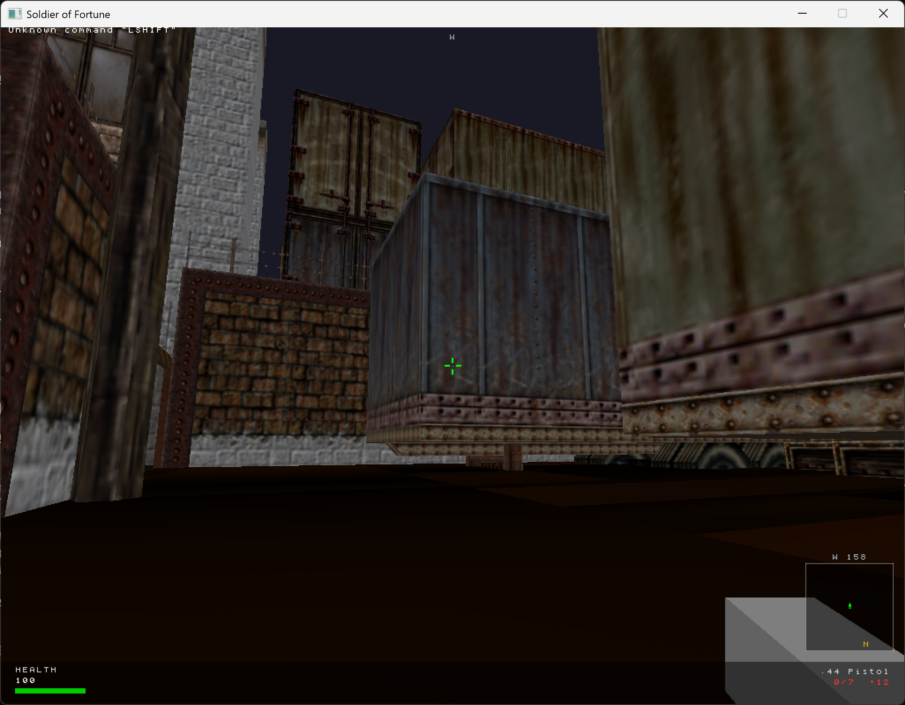

# Soldier of Fortune: Static Recompilation

> *"Consider this Bad Boy and play on an empty stomach"* — **Playboy**
>
> Yes, that quote was on the box. Yes, it was from *that* Playboy.

A static recompilation project to bring **Soldier of Fortune** (2000) back to life on modern systems. Because no one should be denied the experience of watching a guy's arm fly off in 26 individually modeled zones of dismemberment.

## Current Progress



*NYC1 map rendering — rooftop warehouse area with correct BSP geometry, M32 textures, lightmaps, skybox, and HUD.*

The engine boots, loads PAK archives, parses SoF's BSP v46 format, and renders full 3D levels with textured geometry. 40+ source files, 53,000+ lines of code across all subsystems.

### Working Subsystems

| Subsystem | Status |
|-----------|--------|
| PAK filesystem | Fully working — reads pak0.pak (9728 files) + pak1.pak |
| BSP v46 renderer | Working — correct face (44-byte) and leaf (32-byte) structs |
| M32/WAL textures | Working — 7363 textures loaded with correct alpha handling |
| Lightmaps | Working — atlas-based multitexture lightmapping |
| Skybox | Working — TGA skybox rendering |
| Entity spawning | Working — 906 entities parsed on NYC1 |
| Console/Cvars | Working — full command system with config file loading |
| Key bindings | Working — SoF config compatibility |
| HUD | Working — health, minimap, weapon display, compass |
| Sound | SDL2 audio initialized |
| GHOUL init | Gore zone system initialized (model rendering is placeholder) |
| .os Scripts | Bytecode interpreter loads and parses scripts from PAK |
| Game entities | 70+ entity types (triggers, movers, hazards, items) |

## What Is This?

Soldier of Fortune was developed by **Raven Software** and published by **Activision** in 2000. Built on a heavily modified **id Tech 2 (Quake II) engine**, it featured the revolutionary **GHOUL** damage model system — a technology so gratuitously detailed in its depiction of bodily harm that it got the game banned in several countries and slapped with an **ESRB Mature 17+** rating that they probably wished went higher.

The game doesn't run on modern Windows (10/11). At all. This project aims to fix that through static recompilation — no assets included, just the code needed to make your legally obtained copy playable again.

**This is a game preservation project.** We believe games shouldn't just disappear because operating systems moved on.

## Project Goals

- **Static recompilation** of the original x86 Soldier of Fortune executable
- Full compatibility with **Windows 10/11** (64-bit)
- Modern renderer backend (Vulkan/OpenGL 4.x) replacing the legacy OpenGL 1.x pipeline
- Native widescreen and high-resolution support
- Preserve original gameplay 1:1 — every limb flies exactly as Raven intended
- Support for original game assets (you supply your own copy)
- Linux and macOS support (stretch goal)

## Technical Background

### The Engine

SoF runs on a **modified Quake II engine** with significant additions by Raven Software:

| System | Description |
|--------|-------------|
| **GHOUL** | The legendary damage model system. 26 gore zones per character model. Responsible for congressional hearings. |
| **ArghRad!** | Enhanced lighting tool with Phong-type shading and global sunlight |
| **Designer Script (DS)** | Custom scripting language for game logic |
| **ROFF** | Rotation Object File Format — ~500 movement animation files |
| **Dynamic Audio** | Custom music and ambient sound systems |

### Static Recompilation Approach

Rather than emulating or reimplementing the engine from scratch, we perform **static recompilation**:

1. **Disassemble** the original PE executable
2. **Lift** x86 instructions to an intermediate representation
3. **Recompile** to modern x86-64 with contemporary compiler optimizations
4. **Patch** OS-level calls (Win32 API, DirectDraw, legacy OpenGL) to modern equivalents
5. **Rebuild** as a native 64-bit application

This preserves the original game logic with perfect accuracy while making it run on modern systems.

## Project Structure

```
sof/
├── src/
│   ├── engine/      # Core engine recompilation (modified id Tech 2)
│   ├── ghoul/       # GHOUL damage model system
│   ├── game/        # Game logic (gamex86.dll)
│   ├── renderer/    # Rendering backend (ref_gl -> modern)
│   ├── sound/       # Audio system
│   ├── client/      # Client-side code
│   ├── server/      # Server / game hosting
│   └── common/      # Shared utilities and types
├── tools/           # Analysis and build tools
├── docs/            # Technical documentation and notes
├── CMakeLists.txt   # Build system
└── README.md        # You are here
```

## Building

> **Note:** This project is in early development. Build instructions will be updated as components are implemented.

### Prerequisites

- CMake 3.20+
- MSVC (Visual Studio 2022) or compatible C compiler
- vcpkg with SDL2 installed
- A legal copy of Soldier of Fortune (pak0.pak, pak1.pak)

### Build

```bash
cd build
cmake .. -DCMAKE_TOOLCHAIN_FILE=/path/to/vcpkg/scripts/buildsystems/vcpkg.cmake
cmake --build . --config Release
```

### Running

```bash
# Copy pak0.pak and pak1.pak into build/bin/Release/base/
cd build/bin/Release
./sof.exe +map nyc1
```

## Game Compatibility

| Version | Status |
|---------|--------|
| Soldier of Fortune (v1.0) | Target |
| Soldier of Fortune (v1.06a) | Target |
| Soldier of Fortune: Gold Edition | Target |
| Soldier of Fortune: Platinum Edition | Planned |

## Legal

This project contains **no original game assets, code, or copyrighted material** from Activision, Raven Software, or id Software. You must supply your own legally obtained copy of Soldier of Fortune to use this project.

This is a clean-room static recompilation effort for the purpose of **game preservation** and **interoperability** with modern operating systems.

Soldier of Fortune is a trademark of Activision Publishing, Inc. id Tech 2 engine technology by id Software. GHOUL engine technology by Raven Software. This project is not affiliated with or endorsed by any of these companies.

## Contributing

This is a community preservation effort. Contributions are welcome! Check the issues tab for current tasks or open a new one.

If you have technical knowledge of the id Tech 2 engine, Quake II modding experience, or reverse engineering skills — we'd love your help.

## Acknowledgments

- **Raven Software** — for making a game so absurdly violent it became legendary
- **id Software** — for the Quake II engine that made it all possible
- **John Mullins** — the real-life military consultant and absolute unit who the protagonist is based on
- The SoF community who kept the multiplayer alive way longer than anyone expected

---

*"You want me to feel sorry for these guys? They're terrorists."* — John Mullins, in-game

*Built with respect for the original work. This is a preservation project, not a replacement.*
